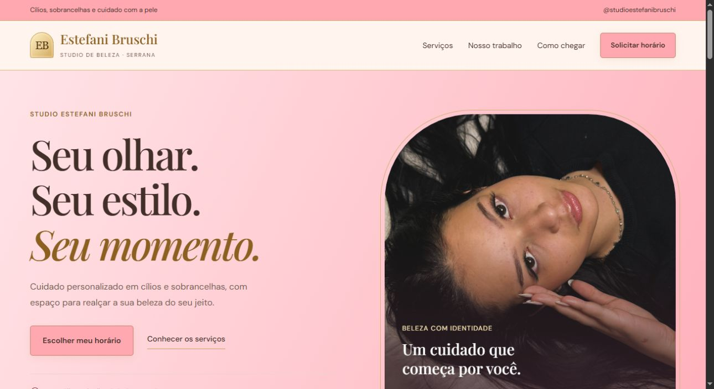
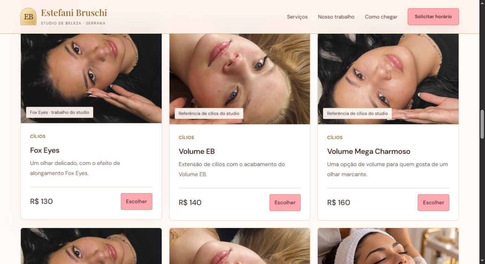
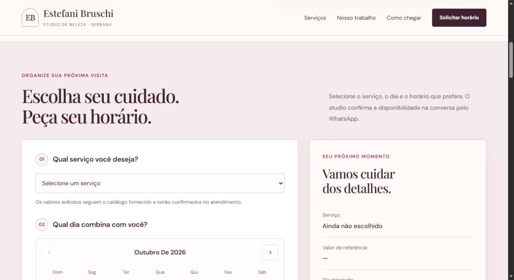

# Studio Estefani Bruschi

Site de apresentação desenvolvido pela **Brusyn**, com catálogo de serviços e solicitação de atendimento pelo WhatsApp.

Identidade em rosa e dourado, conforme a referência da marca, fotos originais de cílios em resolução maior e uma imagem em cada cartão de serviço. As imagens dos cuidados com a pele são ilustrativas e estão identificadas.

**Status: versão para apresentação e revisão antes do lançamento.** O repositório contém o site completo; esta entrega não ativa GitHub Pages nem publica o site em um domínio.



## O que o cliente pode fazer

- Conhecer os serviços e os valores de referência do catálogo.
- Escolher um dia e um horário desejados no calendário.
- Informar seu nome e uma observação opcional.
- Revisar o pedido e abrir o WhatsApp com uma mensagem pronta contendo serviço, data e horário.
- Ver fotos do trabalho do studio, endereço e horários de atendimento.

O horário selecionado é uma **solicitação**, sujeita à confirmação da equipe. O site não consulta horários ocupados nem reserva vagas automaticamente.

## Agenda

| Dia | Atendimento |
| --- | --- |
| Segunda a sexta | 08h às 20h |
| Sábado | 08h às 18h |
| Domingo | 09h às 12h |

Os horários são apresentados de meia em meia hora, no fuso de Brasília. Datas e horários passados ficam indisponíveis. A duração de cada serviço e a disponibilidade real serão confirmadas pelo studio.





## Apresentar o site antes de lançar


2. Extraia a pasta e abra `dist/index.html` no navegador.
3. Para apresentar sem enviar mensagens, confira o pedido no modal de revisão. O envio só ocorre depois que a pessoa abre o WhatsApp e confirma a mensagem no aplicativo.

Também é possível servir a pasta localmente, com Python instalado:

```sh
python -m http.server 8000 --directory dist
```

Depois, abra `http://localhost:8000`.

## Conteúdo e revisão

Contato configurado: **(16) 99243-7184**. Endereço: **R. Amélio Baricalla, 1619, Boa Esperança 2, Serrana, SP, CEP 14150-000**.

Os preços seguem o catálogo fornecido. Dermaplaning está como “A consultar”, pois seu preço não ficou legível na referência. Fotos e links de origem estão descritos em [docs/REFERENCIAS.md](docs/REFERENCIAS.md).

Antes do lançamento, o studio deve revisar o telefone, os serviços, os valores e as fotos. Não há banco de dados, cadastro de clientes nem pagamento online. Os dados preenchidos permanecem no formulário e entram no texto do WhatsApp quando a pessoa decide continuar.

## Estrutura

```text
dist/
  index.html       Página do studio
  styles.css       Layout para celular e computador
  app.js           Catálogo, calendário, revisão e WhatsApp
  assets/          Fotos usadas no site
docs/              Imagens e referências da apresentação
```

Site estático em HTML, CSS e JavaScript, sem instalação de dependências. As fotos, a identidade e o conteúdo do studio não são oferecidos como material livre para reutilização.
